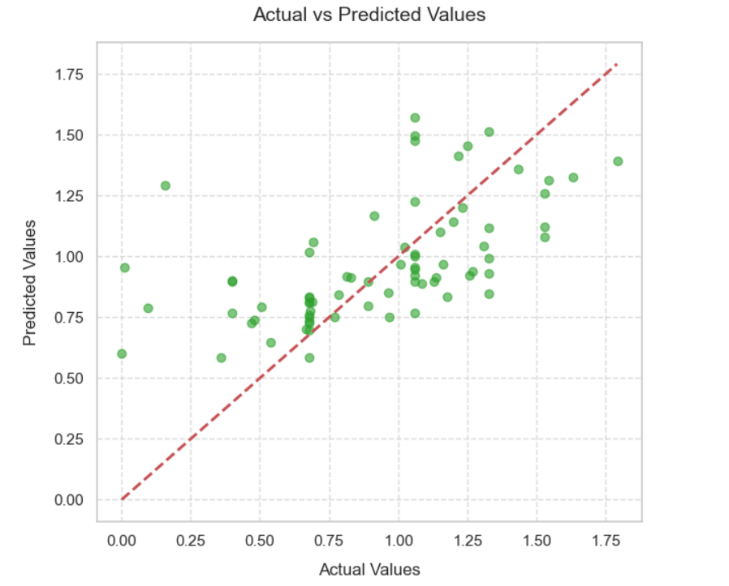

# tip_calculation

<table>
  <tr>
    <td><h1>Hi there 👋  Tip Please </h1></td>
    <td></td>
  </tr>
</table>

### Languages, Libraries, Tools & Technologies that I used in this project

I worked on predicting the income from tips in this project. Specifically, I used a dataset that includes the number of people at the table, whether the environment is smoking or non-smoking, the total bill, the tip paid, the time of day, and the day of the week. I trained multiple models using this data and compared them to select the most successful one. My approaches before model training and the models I used are as follows; 

* feature engineering
* data wrangling
* linear regression
* lasso regression
* ridge regression
* Elastic net linear regression

Additionally, you can see the performance of the most successful prediction model I selected, Ridge regression, in the 'actual vs predicted values' graph below

